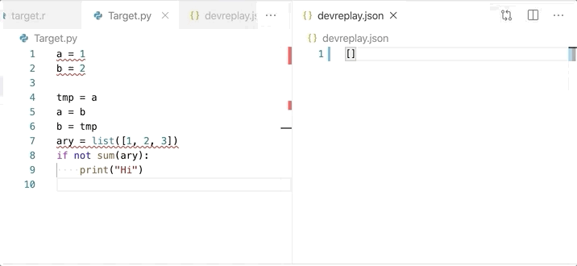

# Change Logger

Logging the changes from HEAD commit for reusing by [DevReplay](https://devreplay.github.io/)

## Usage

## Supported languages

* Python
* Java
* JavaScript
* TypeScript

## Extension Settings

* `changelogger.exec.save`: Execute change logger when a file is saved